# TIENDA DE PRODUCTOS APPLE

## DESCRIPCIÓN

Este proyecto es una tienda en línea inspirada en Apple, donde los usuarios pueden explorar y comprar productos de Apple de manera ficticia. La tienda simula ser una tienda oficial y ofrece una experiencia de compra virtual para productos como Mac, iPhone, iPad, Apple Watch, AirPods y Accesorios.

## SCREENSHOTS - Desktop Light

+   Screenshot tomado del Home:

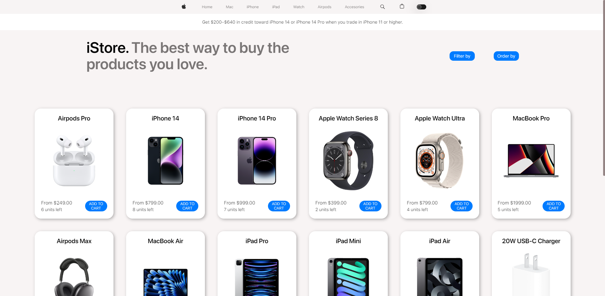

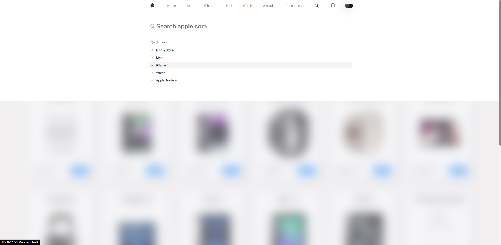

+   Screenshot tomado del Carrito:

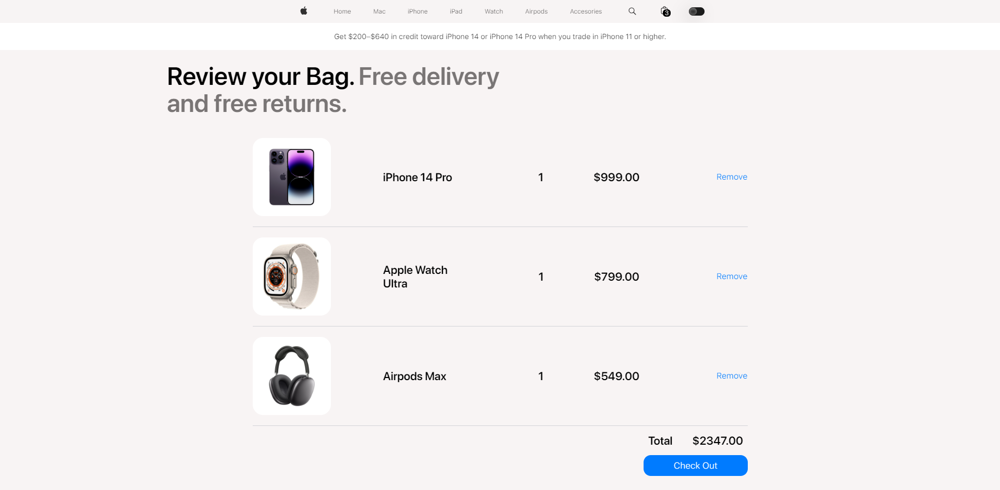

## SCREENSHOTS - Desktop Dark

+   Screenshot tomado del Home:

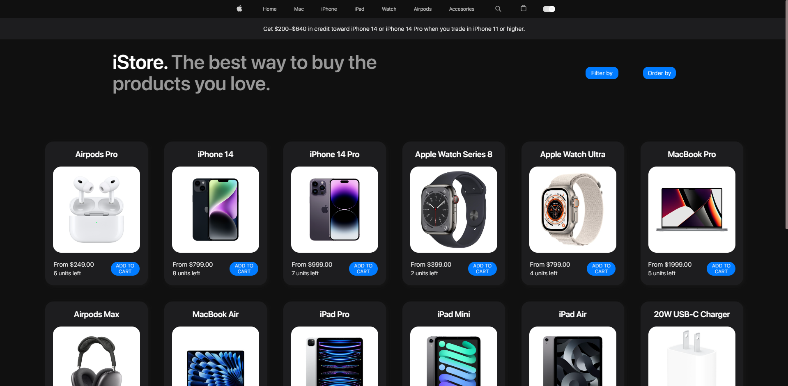

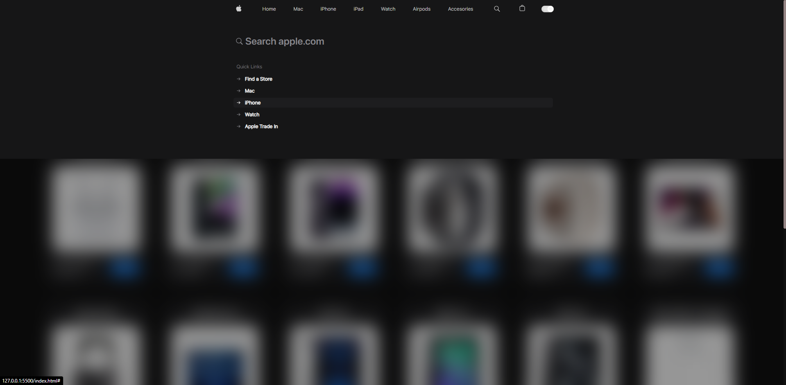

+   Screenshot tomado del Carrito:

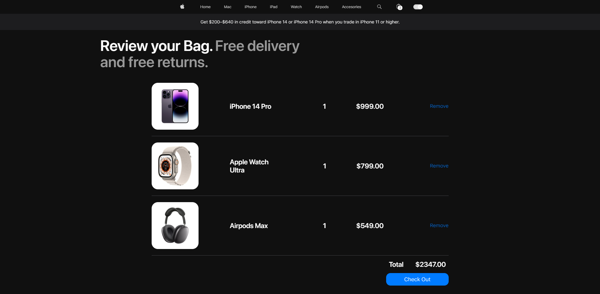

## SREENSHOTS - Mobile Light

+   Screenshot tomado del Home:

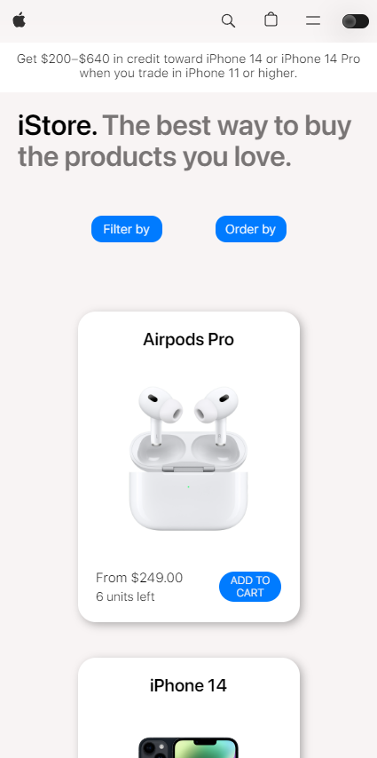

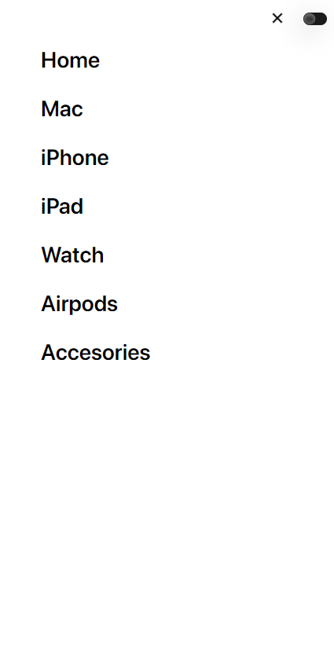

+   Screenshot tomado del Carrito:

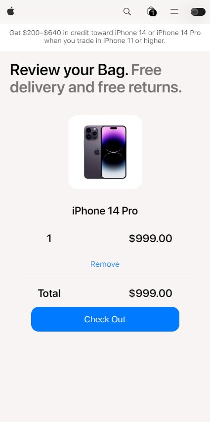

## SCREENSHOTS - Mobile Dark

+   Screenshot tomado del Home:

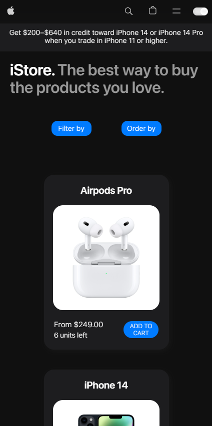

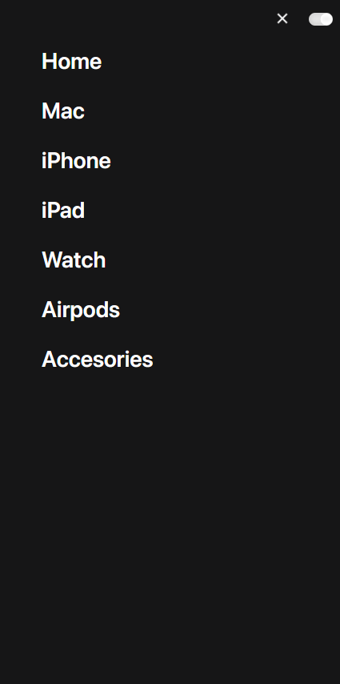

+   Screenshot tomado del Carrito:

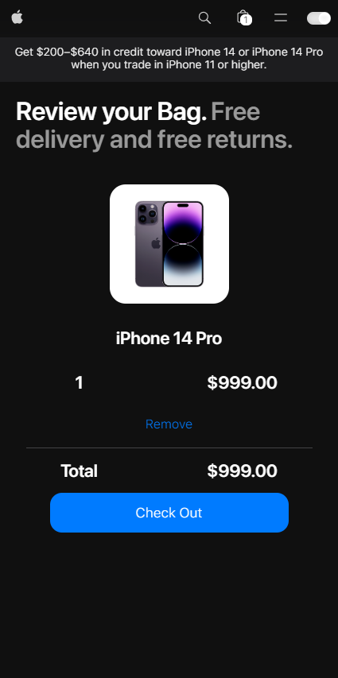

## TECNOLOGÍAS UTILIZADAS

+   HTML5
+   CSS3
+   JavaScript

## LIBRERÍAS UTILIZADAS

+   SweetAlert2

## INSTRUCCIONES DE USO

### DOS MANERAS DE ACCEDER
1. Consola:

    +   Clona este repositorio de manera local.

    +   Abre el archivo index.html en tu navegador web para explorar la tienda de productos de Apple simulada.

```bash
    git clone https://github.com/giancarissimo/javascript-58110-proyectoFinal.git
```

2.  Pages:
    +   Si lo deseas, puedes acceder al archivo a través de githubPages.

            https://giancarissimo.github.io/javascript-58110-proyectoFinal/

## CARACTERÍSTICAS
+   Explora una amplia gama de productos de Apple.
+   Agrega productos al carrito de compras.
+   Elimina productos del carrito de compras.
+   Finaliza la compra y vacía el carrito.
+   Filtra productos por categoría.
+   Ordena productos por nombre o precio.
+   Productos y contenido del carrito almacenados en el localStorage.

## CHANGELOGS 1:
+   El boton de "finalizar compra" se tradujo al inglés.
+   El aviso de "tu carrito está vacío" se hizo mas formal.
+   Se corrigió un problema que generaba que el ordenamiento por 'default' no se ejecute.

## CHANGELOGS 2:
+   Se mejoró la interactividad entre los botones de filtrado y orden.

## CHANGELOGS 3:
+   Se corrigió un problema que, al añadir un producto al carrito y removerlo/comprarlo (con la tienda de productos filtrada), no mostraba los productos en la store.

## CHANGELOGS 4:
+   Se estilizaron las alerts del sitio.
+   Se estilizó, colocó y se hizo funcional el 'total' del carrito.
+   Ahora las cards de los productos tienen decimales en su precio, lo mismo para el subtotal y el total de los productos en el carrito.

## CHANGELOGS 5:
+   Se mejoró el estilo del boton "Finalizar Compra".
+   Se maquetó el header, el carrito, la tienda y las alerts para dispositivos móbiles (tablet & smartphone).
+   Se integró Fetch en Js y se agregaron operadores avanzados (de tipo ternario y &&) para optimizar el código.
+   Ahora la tipografía tiene varios formatos, lo que aumenta la compatibilidad en diferentes dispositivos (Windows, Mac, iOS, Android, etc).
+   Se actualizó la compatibilidad de las animaciones del sitio para diferentes dispositivos.
+   La librería "Bootstrap Icons" se eliminó del proyecto.
+   Las fuentes locales que no se utilizaban, al ocupar almanecamiento, se eliminaron del proyecto para optimizarlo. Ahora de 177mb pasó a 32mb.

## CHANGELOGS 6:
+   Se actualizó el máximo del viewport-width para dispositivos móviles (de 425px a 450px). De ésta manera, ahora por ej el sitio está responsive para dispositivos como el iPhone 13, 14 y 15 Pro Max y otros dispositivos de mismas resoluciones.

## CHANGELOGS 7:
+   Se reemplazó la imagen del iphone 14 (que originalmente era una foto del iphone 13) por una del producto que corresponde.

+   Se agregó una notificación en el ícono del carrito: Si agregamos un producto, además de la notificación, obtendremos un iconito con la cantidad de productos y/o unidades del mismo que agregamos al carrito.

+   Se mejoró el funcionamiento y estilización de los botones de filtrado y orden: Ahora si se clickea fuera de un botón, el menú desplegable del mismo, se cierra.

+   Se integró un botón en el header para intercambiar entre el Light & Dark Theme: Éstos, se almacenan en localStorage para que, si el usuario desesa refrescar la página, se guarde el modo que el usuario eligió previamente.

+   Se mejoraron las animaciones del menú hamburguesa: Ahora cuando se despliega y se cierra, cada opcion de la navbar tiene una animacion y retraso personalizado para que de un efecto de "cascada".

+   Se estilizó y maquetó el Search del sitio: Si se toca en el ícono 'search' se despliega un menu con opciones sugeridas y un input de búsqueda. Este menu, contiene una animación de apertura y cierre.

+   Se mejoró el algoritmo del menu hamburguesa: Está integrado con el 'search'. Si el menu search se despliega, el icono del menu hamburguesa se activa (y queda en su respectiva X), si se presiona nuevamente, se cierra el icono menú hamburguesa y el menu del search, pero si se presiona el hamburguesa de nuevo, se despliega la navbar.

+   Se creó header.js: Éste, contendrá la lógica de la notificación del carrito, boton 'Light-Dark theme', menú 'hamburguesa' y 'search'.
+   Se colocó un favicon para el sitio.

## CHANGELOGS 8:
+   Se mejoró la compatibilidad de las animaciones: ahora mas dispositivos móbiles deberían ver correctamente las animaciones y las transformaciones de todos los objetos del sitio web.

## FUTURAS FUNCIONALIDADES
* [ ]  Agregar contenido a las demas secciones del header.
* [ ]  Hacer funcionar la 'lupa' para buscar un producto o una sección del sitio web.
* [x]  Estilizar, colocar y hacer funcionar el 'total' del carrito.
* [x]  Mejorar las alerts del sitio.
* [x]  Maquetar el responsive.
* [x]  Aumentar la compatibilidad de la tipografía y de las animaciones.
* [x]  Alternar entre Light & Dark Theme en el sitio.
* [x]  Optimizar el almacenamiento.
* [ ]  Implementar SEO.