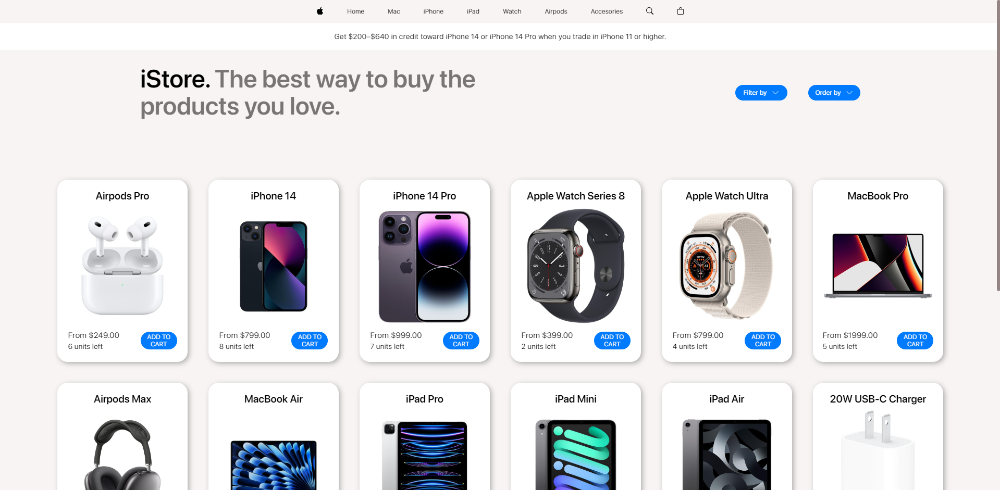
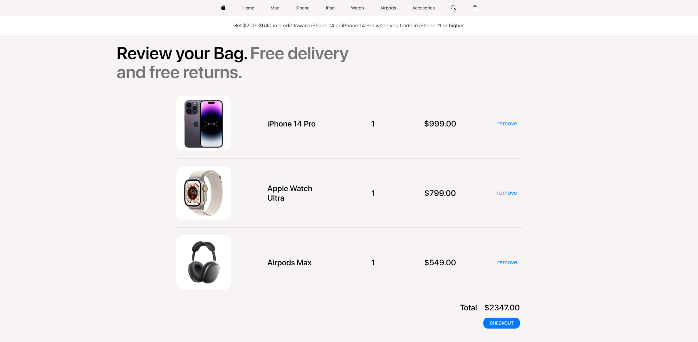
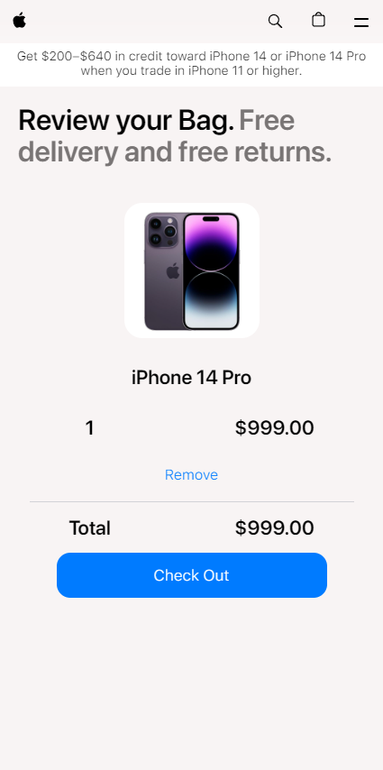
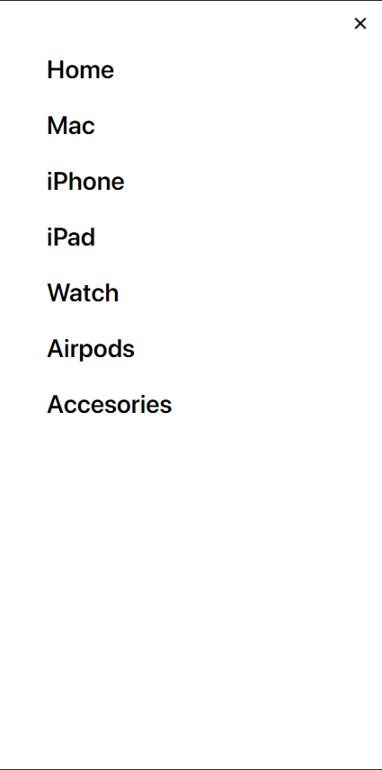

# TIENDA DE PRODUCTOS APPLE

## DESCRIPCIÓN

Este proyecto es una tienda en línea inspirada en Apple, donde los usuarios pueden explorar y comprar productos de Apple de manera ficticia. La tienda simula ser una tienda oficial y ofrece una experiencia de compra virtual para productos como Mac, iPhone, iPad, Apple Watch, AirPods y Accesorios.

## CAPTURA DE PANTALLA 1 - Desktop



Screenshot tomado del Home.

## CAPTURA DE PANTALLA 2 - Desktop



Screenshot tomado del Carrito.

## CAPTURA DE PANTALLA 1 - Mobile



Screenshot tomado del Carrito.

## CAPTURA DE PANTALLA 2 - Mobile



Screenshot tomado del Menu Hamburguesa.

## TECNOLOGÍAS UTILIZADAS

+   HTML5
+   CSS3
+   JavaScript

## LIBRERÍAS UTILIZADAS

+   SweetAlert2

## INSTRUCCIONES DE USO

### DOS MANERAS DE ACCEDER
1. Consola:

    +   Clona este repositorio de manera local.

    +   Abre el archivo index.html en tu navegador web para explorar la tienda de productos de Apple simulada.

```bash
    git clone https://github.com/giancarissimo/javascript-58110-proyectoFinal.git
```

2.  Pages:
    +   Si lo deseas, puedes acceder al archivo a través de githubPages.

            https://giancarissimo.github.io/javascript-58110-proyectoFinal/

## CARACTERÍSTICAS
+   Explora una amplia gama de productos de Apple.
+   Agrega productos al carrito de compras.
+   Elimina productos del carrito de compras.
+   Finaliza la compra y vacía el carrito.
+   Filtra productos por categoría.
+   Ordena productos por nombre o precio.
+   Productos y contenido del carrito almacenados en el localStorage.

## CHANGELOGS 1:
+   El boton de "finalizar compra" se tradujo al inglés.
+   El aviso de "tu carrito está vacío" se hizo mas formal.
+   Se corrigió un problema que generaba que el ordenamiento por 'default' no se ejecute.

## CHANGELOGS 2:
+   Se mejoró la interactividad entre los botones de filtrado y orden.

## CHANGELOGS 3:
+   Se corrigió un problema que, al añadir un producto al carrito y removerlo/comprarlo (con la tienda de productos filtrada), no mostraba los productos en la store.

## CHANGELOGS 4:
+   Se estilizaron las alerts del sitio.
+   Se estilizó, colocó y se hizo funcional el 'total' del carrito.
+   Ahora las cards de los productos tienen decimales en su precio, lo mismo para el subtotal y el total de los productos en el carrito.

## CHANGELOGS 5:
+   Se mejoró el estilo del boton "Finalizar Compra".
+   Se maquetó el header, el carrito, la tienda y las alerts para dispositivos móbiles (tablet & smartphone).
+   Se integró Fetch en Js y se agregaron operadores avanzados (de tipo ternario y &&) para optimizar el código.
+   Ahora la tipografía tiene varios formatos, lo que aumenta la compatibilidad en diferentes dispositivos (Windows, Mac, iOS, Android, etc).
+   Se actualizó la compatibilidad de las animaciones del sitio para diferentes dispositivos.
+   La librería "Bootstrap Icons" se eliminó del proyecto.
+   Las fuentes locales que no se utilizaban, al ocupar almanecamiento, se eliminaron del proyecto para optimizarlo. Ahora de 177mb pasó a 32mb.

## FUTURAS FUNCIONALIDADES
* [ ]  Agregar contenido a las demas secciones del header.
* [ ]  Estilizar y hacer funcionar la 'lupa' para buscar un producto.
* [x]  Estilizar, colocar y hacer funcionar el 'total' del carrito.
* [x]  Mejorar las alerts del sitio.
* [x]  Maquetar el responsive.
* [x]  Aumentar la compatibilidad de la tipografía y de las animaciones.
* [x]  Optimizar el almacenamiento.
* [ ]  Implementar SEO.